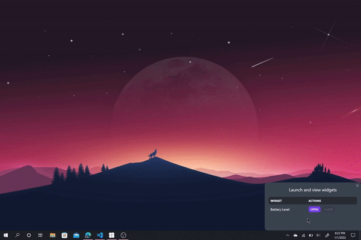

# Zwidget

[](https://microsoft.com/windows/) [](https://www.repostatus.org/#wip)

Zwidget is an <a href="https://github.com/electron/electron">Electron</a> app that allows you to easily launch widgets on your Windows desktop — well, sort of. The widgets are essentially browser windows that are stuck to the bottom of the Z-index stack when they're created (hence the name).

<p align="center"></img></p>

## Architecture

Each widget has a backend layer and a frontend layer. The backend is usually a single JavaScript file, where Node.js APIs can be used, while the frontend is composed of an HTML template, a CSS file, and a JavaScript file, where modern web browser APIs can be used in the renderer process. Conforming to the architecture of an Electron app, a preload JavaScript file helps the backend and the frontend communicate to each-other by exposing API endpoints to the renderer.

<p align="center"></p>

## Quick start

1. Run `npm install` in the root directory to install the project's dependencies.
2. Run `npm start` to build the CSS files, and start the app.

**NOTE**: The npm scripts in this repo's `package.json` will work only if you're running them with the `Git Bash` shell. To use the `Git Bash` shell, run this command on the terminal:

```bash
npm config set script-shell "C:\Program Files\Git\bin\bash.exe"
```

This is assuming you have installed `Git Bash` on your machine, and your `Git Bash` executable is located in the path above. However, you can also use the `PowerShell` shell like this, but keep in mind you'd have to make changes to `package.json` and the scripts in the `scripts` directory:

```bash
npm config set script-shell "powershell"
```

## How to add your own widget (to the existing file structure)

This repository's code was developed with the intention of making it as easy as possible for someone who has web development experience to create their own widget by using the existing code and directory structure. Therefore, several scripts have been included in the `scripts` directory to allow the developer to focus only on the widget's appearance and functionality. However, it is important to preserve the existing structure of the repo; otherwise, you will have to modify the scripts, in order to make them work.

To add your widget to the existing file structure, run the `create-files` npm script in the root directory:

```bash
npm run create-files '[Widget Name]' '[width]' '[height]'   # e.g. npm run create-files 'Stock Watch' '400' '200'
```

This script will generate these files in their respective directories (their names will be `camelCased` according to the name of the widget):

- A template HTML file in `src/renderer/templates`.
- An input CSS file in `src/renderer/css/input`. You will most likely never have to change this file.
- A JavaScript file in `src/renderer/javascript`. This file will contain the renderer logic of the widget.
- A JavaScript preload file in the `src/preload` directory. You will most likely never have to change this file.
- A JavaScript file in `src/main/widgets-backend`. This file will contain the backend logic of your widget.

The script will also define a widget object in the `widgets.js` file, located in `src/main`, and add this file to the `allWidgets` array. This is necessary for the window of the widget to be created when needed.
